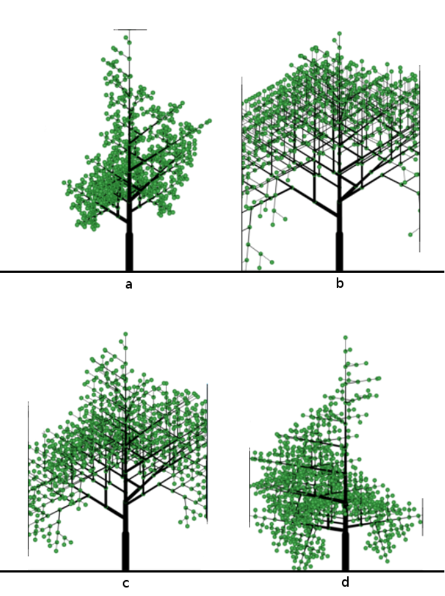

It is 2017, I am working as a working student at UDATA, and we are trying to make environment education "cool" again. So we came up with [Urnature](https://urnature.de/), a cute little education app that integrates with existing learning trails in nature reservations and enriches them with minigames, fact checks, …

At that point in time I was really into procedural generation (labyrinth games!), so I took the opportunity of my upcoming Bachelor thesis to do something useful for a change — procedurally generate 2D trees for use in an Android app!

I did so by formulating [Lindenmayer systems](https://en.wikipedia.org/wiki/L-system) rules, and tried to adapt the parameters to 'recreate' existing trees. It works (😇), although the performance is terrible and therefore is not fit for use in real-time applications. Still quite cool!

You can read more about it [here](/ProzGenTrees.pdf), although it is in German. Well, still nice for the pictures :)

_(Some generated trees. The artifacts show where the trees border screen)_
