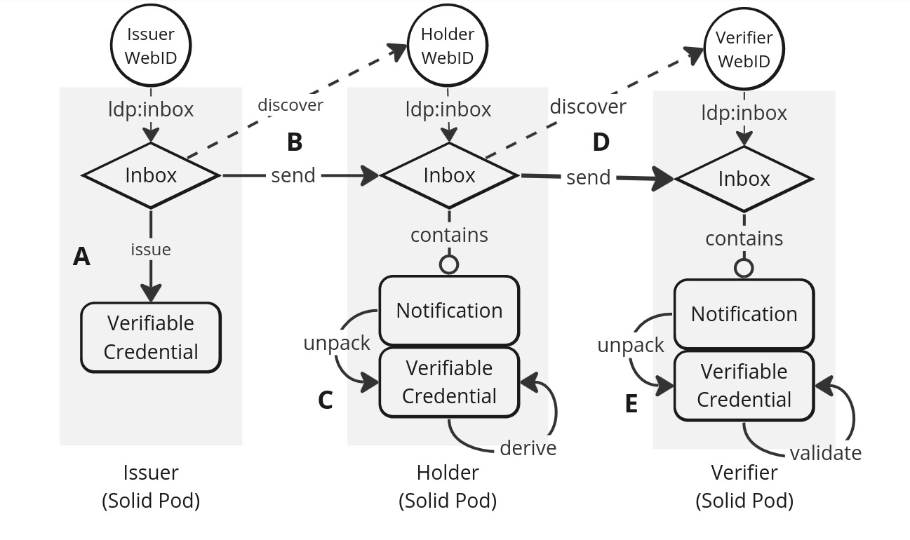

As part of my research into Data Flow in Personal [Data Spaces](https://digital-strategy.ec.europa.eu/en/policies/data-spaces), I came up with an "Inter-Pod Credential Exchange Protocol" via [Solid](https://solidproject.org/) and [LDN](https://www.w3.org/TR/ldn/).

Basically we have different data stores (Pods) in Solid, and we want to exchange verifiable credentials ([VC](https://www.w3.org/TR/vc-data-model/)) between them. So I propose to use the existing LDN spec as application-level protocol in combination with [DIDComm Messaging Headers](https://identity.foundation/didcomm-messaging/spec/v2.1/), as they can be easily extended.

To demo it, we mimic a common [Self-Sovereign Identity](https://en.wikipedia.org/wiki/Self-sovereign_identity) flow, where party A issues a credential to party B, and party B sends it to party C to have it verified.

The code can be found at [Github](https://github.com/SolidLabResearch/inter-pod-credential-exchange-protocol), and the paper is in the ESWC24 SDS workshop proceedings.

