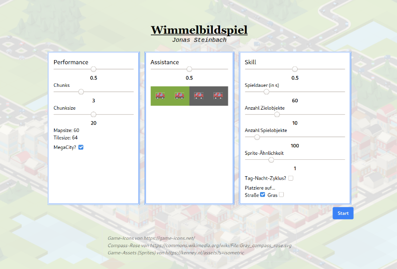
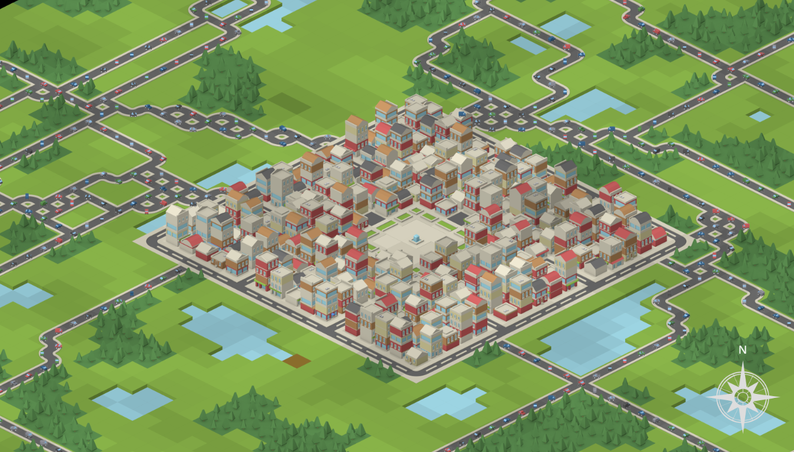

Let's turn back to 2020, with Covid looming, and me stuck at my parents house, wondering what to do for my master thesis. Luckily the _Fraunhofer IOSB_ was investigating adaptive learning environments for "Bildaufklärer" (radar image object interpreters) at that time, with them being very interested in [Dynamic Difficulty Adjustment (DDA)](https://en.wikipedia.org/wiki/Dynamic_game_difficulty_balancing). And as luck willed it, they were searching for me, a bright, young and motivated thesis student, to create a DDA testbed. 

So while the world went mad, I sat at home and studied adaptive learning environments, with the aim of inducing [Flow](https://en.wikipedia.org/wiki/Flow_(psychology)) in learners by automatically adjusting the difficulty of learning games to neither be too challenging nor too easy. 

I did this by creating a game (😇) with HTML, Typescript and the [Phaser](https://phaser.io/) framework. Very proud of that one. I procedurally generate a map, then place little cars on it, and let the user find them. As it is a DDA test-bed, it has a lot of knobs and whistles to change the game difficulty, including day-night modus and alien invaders (distractors)!

I unfortunately I can't demo the game here (_Webpack security issues_…), but you can read my thesis [here](/master-thesis.pdf) — It won an award for best, and also published at _CELDA21_ (_Atorf 2021 "Towards a concept for a hidden object game
with dynamic difficulty adjustment"_).

_A beatifully generated city and world!_
